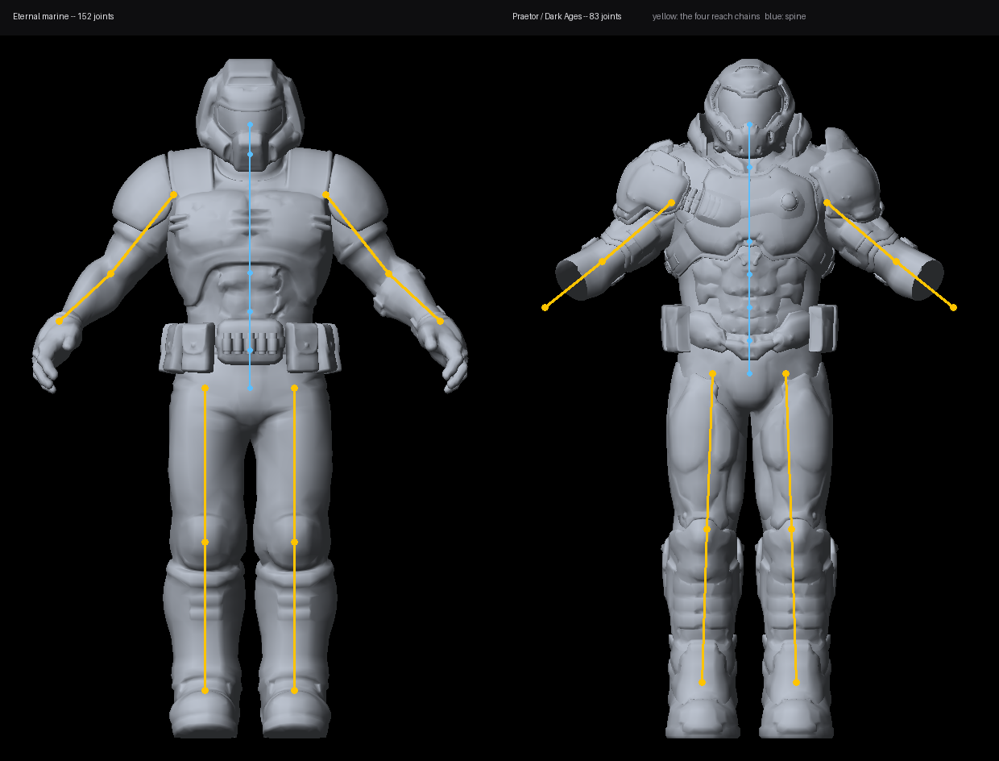

# RS_VRBody

Player IK body for the UZDXREMA engine. Two selectable bodies — the Doom Eternal marine and
the Dark Ages Praetor. IK arms and hands. Hot-swappable torsos, arms, hands, boots. Player
torsos change colour / model to reflect armour and health status. Extensive customization
options. 9 body holsters using Quake models. Also, UZDXREMA supports Quake 1 assets now, lol.

*Flat-shaded and untextured on purpose: the meshes and textures stay off this remote (see
Assets). Yellow is the four reach chains the engine solver drives; blue is the spine.*

## What the rig does

**Arms follow your controllers.** Two engine reach chains per body, aimed at the
controller-tracked hands. The chain's end effector is the wrist — but the point that has to
land on your hand is the **palm**, and those are a whole hand apart. The offset is measured
off each mesh (marine 1.927 units, Praetor 2.009) and given to the solver in the chain's own
units, so nothing has to be converted into the hand model's scale.

**Legs step, and a planted foot does not slide.** Two more chains, aimed at foot targets a
step machine walks around the world. The whole trick is restraint: a planted foot's target
is simply *not moved*. Steps land ahead of the body scaled by your speed, only one foot
swings at a time, and the ground is sampled per foot — so a foot on a stair lands on the
stair.

**Crouch and lean come free with that.** The body is seated off the headset, so crouching
brings the hips down. With the feet held, the same motion bends the knees instead of sinking
the body through the floor. Leaning is the same trick sideways.

**Your own head is hidden; everyone else still sees one.** Three separate switches — visor,
helmet shell, your own face — because they are three different things to be inside.

**Holsters belong to the body.** Nine of them, each with its own page of sliders that move
it while you drag. A seat that is right on the marine is wrong on the Praetor, so the whole
layout — position, rotation, size — travels with the body and switches when you do.

## Bodies

| | joints | rig family |
|---|---|---|
| Eternal marine | 152 | id Software (`bip_*`) |
| Praetor / Dark Ages | 83 | ValveBiped |

Both families are tabled rather than assumed. Hardcoding one set of joint names leaves the
other body's limbs hanging dead — compiling cleanly, drawing fine, never bending.

## Assets

The meshes and textures are not in this repository and never will be: they are ripped game
assets and this remote is public. `PROVENANCE.md` beside each `models/` folder records where
each one came from, and `build.ps1` packs them from disk into a local pk3.
